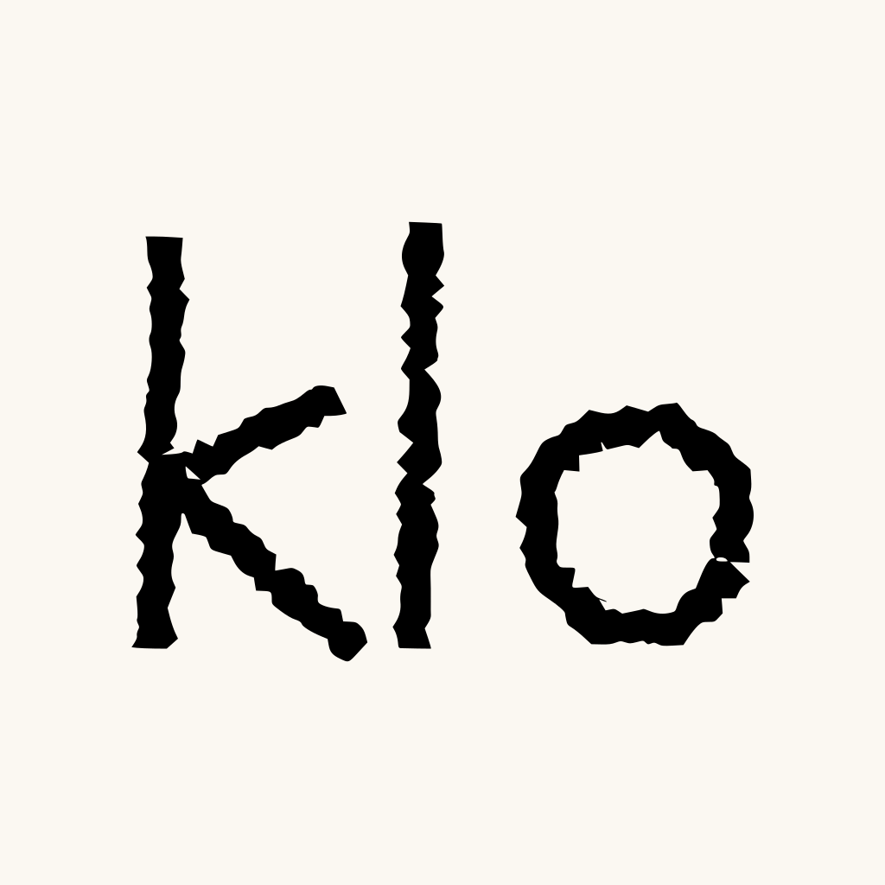
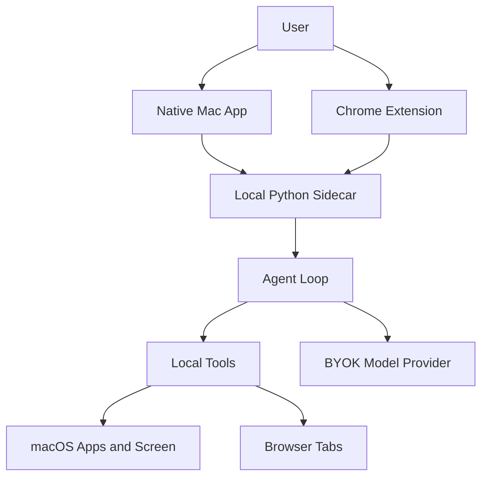

<p align="center">
  <a href="https://getklo.com">
    
  </a>
</p>

<h1 align="center">KLO Local</h1>

<p align="center">
  Open-source computer-use agent for Mac and Chrome. Inspect what it sees,
  control what it can do, run it locally, and extend it with your own tools.
</p>

<p align="center">
  <a href="https://getklo.com"><strong>Get Hosted KLO</strong></a>
  ·
  <a href="https://github.com/elvniv/klo-local/stargazers"><strong>Star KLO Local</strong></a>
  ·
  <a href="docs/privacy.md"><strong>Privacy</strong></a>
  ·
  <a href="docs/architecture.md"><strong>Architecture</strong></a>
</p>

KLO Local is an open-source computer-use agent for Mac and Chrome. It runs a
local sidecar, talks to your model provider with your own API key, sees your
screen only during turns you start, and can control apps/browser tabs through
auditable tools.

The goal is simple: make the trust boundary inspectable. You can read the Mac
app, browser extension, agent loop, prompts, tools, and safety checks before you
let KLO touch your computer.

KLO Local is built by the team behind [KLO](https://getklo.com). The open-source
local version is for developers who want full visibility and control. Hosted KLO
adds managed models, sync, memory, schedules, mobile/cloud handoff, hosted
connectors, official signed builds, updates, teams, support, and reliability.

## Status

KLO Local is an early public release of a real product codebase. The default
path is local-first and BYOK. Some hosted KLO UI surfaces are present in the Mac
app and extension because the public repo shares code with the managed product;
they are inactive unless you explicitly configure hosted mode.

## What Is Included

- Native macOS notch app in `desktop-mac`
- Chrome extension bridge in `extension`
- Local Python sidecar and agent loop in `agent2`
- CLI and diagnostics in `cli`
- Local tools, prompts, approval/safety logic, and tests

## Quick Start

```bash
git clone https://github.com/elvniv/klo-local.git
cd klo-local
cp .env.example .env
```

Edit `.env` and set either `OPENAI_API_KEY` or `ANTHROPIC_API_KEY`.

```bash
python3.11 -m venv .venv
source .venv/bin/activate
pip install -e ".[dev]"
klo-doctor
klo-api
```

In another terminal:

```bash
klo "summarize what is on my screen"
```

## Mac App

The native app lives in `desktop-mac`.

```bash
brew install xcodegen
cd desktop-mac
xcodegen generate
xcodebuild -project KLO.xcodeproj -scheme KLO -configuration Debug -destination "platform=macOS" build
open ~/Library/Developer/Xcode/DerivedData/KLO-*/Build/Products/Debug/KLO.app
```

Use `⌘K` to open the notch UI. Public local builds use automatic/ad-hoc signing
by default. If you distribute your own signed build, use your own Apple
Developer identity.

## Chrome Extension

Load the unpacked extension from `extension`:

1. Open `chrome://extensions`.
2. Enable Developer Mode.
3. Click Load unpacked.
4. Select the `extension` directory.

The extension connects to the local sidecar at `ws://127.0.0.1:8767/extension`.
It does not need hosted KLO to expose local tab reading/clicking/filling tools.

## Where To Start

If you are reviewing or hacking on the repo, start here:

- `agent2/agent.py`: model loop and turn orchestration
- `agent2/prompts.py`: system prompt and safety posture
- `agent2/tools.py`: local tools and approval boundaries
- `agent2/desktop_api.py`: local sidecar API used by the Mac app
- `extension/background.js`: Chrome bridge and browser RPCs
- `desktop-mac/KLO/Agent/AgentClient.swift`: Mac app to sidecar contract

## Permissions

KLO needs macOS permissions only when you ask it to act:

- Accessibility: click, type, press keys, and drive apps.
- Screen Recording: inspect the current screen.
- Apple Events: interact with scriptable apps when needed.

Run `klo-doctor` after setup. It performs real probes instead of only checking
whether a checkbox appears enabled in System Settings.

## Architecture



More detail:

- `docs/architecture.md`
- `docs/privacy.md`
- `docs/tools.md`
- `docs/local-vs-hosted.md`

## Development

```bash
uv sync --extra dev
uv run pytest tests/ -q
uv run python -m agent2.desktop_api
```

The project is intentionally local-first. Set `KLO_MODE=hosted` only if you are
developing an official hosted KLO integration.

## Hosted KLO

KLO Local should stay useful without signup. Hosted KLO exists for people and
teams who want the managed product: signed builds, automatic updates, hosted
model routing, sync, memory, schedules, mobile/cloud handoff, connectors, and
support.

Learn more at [getklo.com](https://getklo.com).

## License

Apache-2.0. See `LICENSE`.
