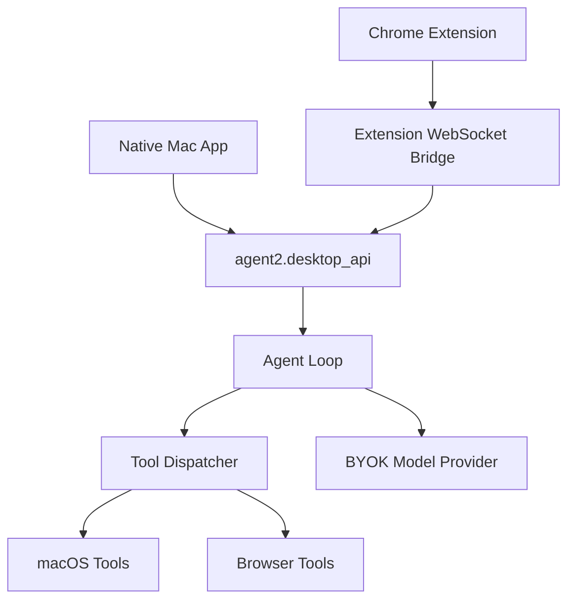

# Architecture

KLO Local has three runtime surfaces:

## Native Mac App

Path: `desktop-mac`

The Swift app owns the user-facing notch UI, global hotkeys, local sidecar
launch, permission UX, and run state. It talks to the sidecar at
`http://127.0.0.1:8787`.

## Local Sidecar

Path: `agent2`

`agent2.desktop_api` exposes the local HTTP/WebSocket contract:

- `POST /runs`
- `WS /ws/runs/{id}`
- `POST /runs/{id}/cancel`
- `POST /runs/{id}/confirm`
- `GET /health`

It runs the agent loop and owns the Chrome extension bridge server.

## Agent Loop

Paths:

- `agent2/agent.py`
- `agent2/prompts.py`
- `agent2/tools.py`

The model receives the system prompt, tool schemas, recent conversation
context, and runtime state. It emits tool calls; the dispatcher executes them
and returns observations until the run finishes or is cancelled.

## Chrome Extension

Path: `extension`

The extension maintains a WebSocket to the local sidecar and exposes tab
operations: list, read, screenshot, click, fill, evaluate, and DOM snapshot.

## Hosted Mode

KLO Local defaults to `KLO_MODE=local`. Hosted mode is optional and reserved for
official KLO integrations such as sync, billing, hosted connectors, and mobile
handoff.

See `docs/local-vs-hosted.md` for the local/hosted boundary.
